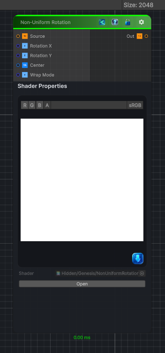

<link rel="stylesheet" href="../_assets/theme.css">

<button type="button" class="genesis-theme-toggle" data-genesis-theme-toggle aria-label="Toggle theme">Dark</button>

---
category: "Transform"
---

# Non-Uniform Rotation

> Non‑Uniform Rotation is a killer addition to your coordinate‑space toolkit — it’s the rotational equivalent of Non‑Square Transform. Instead of scaling X and Y independently, we rotate UVs with different rotation angles per axis, producing:

## Description

 Non‑Uniform Rotation is a killer addition to your coordinate‑space toolkit — it’s the rotational equivalent of Non‑Square Transform. Instead of scaling X and Y independently, we rotate UVs with different rotation angles per axis, producing:
✔ Anisotropic rotation
✔ Direction‑dependent twisting
✔ Elliptical swirl effects
✔ Pre‑warping for polar, kaleidoscope, and flow nodes
✔ Perfect for procedural shapes, noise, and patterns

## Inputs

| Name | Type | Description |
|------|------|-------------|
| Source | Texture2D |  |
| Rotation X | Single |  |
| Rotation Y | Single |  |
| Center | Vector4 |  |
| Wrap Mode | Single |  |

## Outputs

| Name | Type |
|------|------|
| Out | Texture2D |

## Parameters

| Setting | Type | Default | Description |
|---------|------|---------|-------------|
| Rotation X | Range | 0.0 | Controls the rotation x. |
| Rotation Y | Range | 0.0 | Controls the rotation y. |
| Center | Vector | (0.5, 0.5, 0.5, 0) | Controls the center. |
| Wrap Mode | Enum | 0 | Controls the wrap mode. |

## See Also

- [Back to Non-Uniform Rotation](./transform-index.md)
