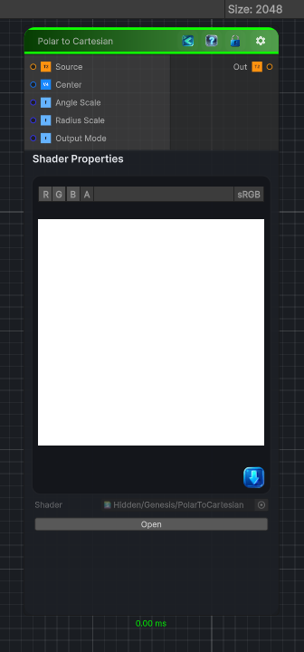

<link rel="stylesheet" href="../_assets/theme.css">

<button type="button" class="genesis-theme-toggle" data-genesis-theme-toggle aria-label="Toggle theme">Dark</button>

---
category: "Transform"
---

# Polar to Cartesian

> Polar → Cartesian is the perfect companion to your Cartesian → Polar node. Together they form a complete bidirectional coordinate‑space toolkit — essential for:

## Description

 Polar → Cartesian is the perfect companion to your Cartesian → Polar node. Together they form a complete bidirectional coordinate‑space toolkit — essential for:
- Undoing polar warps
- Reconstructing circular patterns
- Building kaleidoscopes
- Radial → planar mapping
- Procedural shape generation
- Reversing Genesis’s Polar Transform

## Inputs

| Name | Type | Description |
|------|------|-------------|
| Source | Texture2D |  |
| Center | Vector4 |  |
| Angle Scale | Single |  |
| Radius Scale | Single |  |
| Output Mode | Single |  |

## Outputs

| Name | Type |
|------|------|
| Out | Texture2D |

## Parameters

| Setting | Type | Default | Description |
|---------|------|---------|-------------|
| Center | Vector | (0.5, 0.5, 0.5, 0) | Controls the center. |
| Angle Scale | Range | 1.0 | Controls the angle scale. |
| Radius Scale | Range | 1.0 | Controls the radius scale. |
| Output Mode | Enum | 1 | Controls the output mode. |

## See Also

- [Back to Polar to Cartesian](./transform-index.md)
