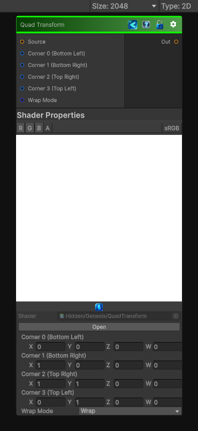

<link rel="stylesheet" href="../_assets/theme.css">

<button type="button" class="genesis-theme-toggle" data-genesis-theme-toggle aria-label="Toggle theme">Dark</button>

---
category: "Transform"
---

# Quad Transform

> Maps any quadrilateral → any quadrilateral, which means:

## Description

Maps any quadrilateral → any quadrilateral, which means:
✔ Perspective‑correct warping
✔ Skewing, shearing, corner‑pinning
✔ Mapping textures onto arbitrary 4‑point shapes
✔ Undoing perspective distortion
✔ Preparing masks for projection, decals, UI, etc.
To recreate this in Genesis CRT, we need a bilinear quad mapping:
- Given UV (u, v)
- Map it into a quadrilateral defined by four corner points
- Sample the source texture at that warped coordinate

## Inputs

| Name | Type | Description |
|------|------|-------------|

## Outputs

| Name | Type |
|------|------|

## Parameters

| Setting | Type | Default | Description |
|---------|------|---------|-------------|
| Corner 0 (Bottom Left) | Vector | (0.0, 0.0, 0, 0) | Controls the corner 0 (bottom left). |
| Corner 1 (Bottom Right) | Vector | (1.0, 0.0, 0, 0) | Controls the corner 1 (bottom right). |
| Corner 2 (Top Right) | Vector | (1.0, 1.0, 0, 0) | Controls the corner 2 (top right). |
| Corner 3 (Top Left) | Vector | (0.0, 1.0, 0, 0) | Controls the corner 3 (top left). |
| Wrap Mode | Enum | 0 // 0 = wrap, 1 = clamp | Controls the wrap mode. |

## See Also

- [Back to Quad Transform](./transform-index.md)
