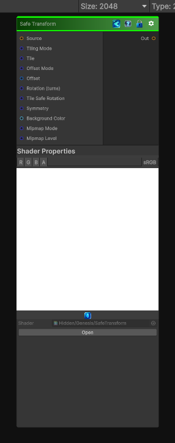

<link rel="stylesheet" href="../_assets/theme.css">

<button type="button" class="genesis-theme-toggle" data-genesis-theme-toggle aria-label="Toggle theme">Dark</button>

---
category: "Transform"
---

# Safe Transform

> A tiling-safe version of Transform 2D inspired by Substance Designer's Safe Transform node.

## Description

A tiling-safe version of Transform 2D inspired by Substance Designer's Safe Transform node.

It lets you tile, offset, rotate, mirror, and optionally fill out-of-bounds space without the usual softening you get from tiny sub-pixel moves.

This version focuses on the core Safe Transform workflow:
- Tile count
- Manual or pseudo-random offset
- Rotation in turns
- Optional safe rotation snapping
- X / Y symmetry
- Manual mip selection for sharper minified results

The node operates on the incoming image input and supports 2D, 3D, and cubemap textures.

## Inputs

| Name | Type | Description |
|------|------|-------------|

## Outputs

| Name | Type |
|------|------|

## Parameters

| Setting | Type | Default | Description |
|---------|------|---------|-------------|
| Tiling Mode | Keyword Enum | 1 | Controls the tiling mode. |
| Tile | Range | 1 | Controls the tile. |
| Offset Mode | Keyword Enum | 0 | Controls the offset mode. |
| Offset | Vector | (0.0, 0.0, 0.0, 0.0) | Controls the offset. |
| Rotation (turns) | Range | 0.0 | Controls the rotation (turns). |
| Tile Safe Rotation | Toggle | 1 | Controls the tile safe rotation. |
| Symmetry | Enum | 0 | Controls the symmetry. |
| Background Color | Color | (0.0, 0.0, 0.0, 1.0) | Controls the background color. |
| Mipmap Mode | Keyword Enum | 0 | Controls the mipmap mode. |
| Mipmap Level | Range | 0 | Controls the mipmap level. |

## See Also

- [Back to Safe Transform](./transform-index.md)
