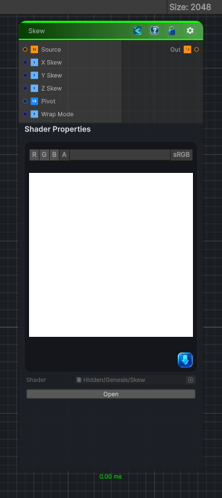

<link rel="stylesheet" href="../_assets/theme.css">

<button type="button" class="genesis-theme-toggle" data-genesis-theme-toggle aria-label="Toggle theme">Dark</button>

---
category: "Transform"
---

# Skew

> - Slanted patterns

## Description

 - Slanted patterns
- Perspective‑like shears
- Stylized distortions
- Pre‑warping shapes before rotation or polar transforms
- Creating italicized or slanted procedural elements
A proper Skew node lets you shear UVs along X or Y, with:

## Inputs

| Name | Type | Description |
|------|------|-------------|
| Source | Texture2D |  |
| X Skew | Single |  |
| Y Skew | Single |  |
| Z Skew | Single |  |
| Pivot | Vector4 |  |
| Wrap Mode | Single |  |

## Outputs

| Name | Type |
|------|------|
| Out | Texture2D |

## Parameters

| Setting | Type | Default | Description |
|---------|------|---------|-------------|
| X Skew | Range | 0.0 | Controls the x skew. |
| Y Skew | Range | 0.0 | Controls the y skew. |
| Z Skew | Range | 0.0 | Controls the z skew. |
| Pivot | Vector | (0.5, 0.5, 0.5, 0) | Controls the pivot. |
| Wrap Mode | Enum | 0 // 0 = wrap, 1 = clamp | Controls the wrap mode. |

## See Also

- [Back to Skew](./transform-index.md)
