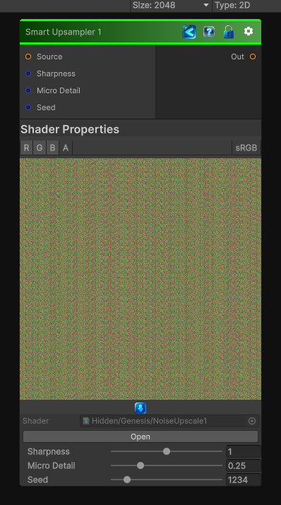

<link rel="stylesheet" href="../_assets/theme.css">

<button type="button" class="genesis-theme-toggle" data-genesis-theme-toggle aria-label="Toggle theme">Dark</button>

---
category: "Transform"
---

# Smart Upsampler 1

> Smart Upsampler 1 takes a low‑resolution noise and reconstructs a higher‑resolution version that preserves the character of the original while adding subtle detail. It’s not just bilinear or bicubic; it’s a content‑aware upscale that:

## Description

Smart Upsampler 1 takes a low‑resolution noise and reconstructs a higher‑resolution version that preserves the character of the original while adding subtle detail. It’s not just bilinear or bicubic; it’s a content‑aware upscale that:
✔ Reconstructs sharper edges
✔ Preserves noise structure
✔ Adds micro‑detail
✔ Avoids blur and ringing
✔ Works for grayscale or color

## Inputs

| Name | Type | Description |
|------|------|-------------|

## Outputs

| Name | Type |
|------|------|

## Parameters

| Setting | Type | Default | Description |
|---------|------|---------|-------------|
| Sharpness | Range | 1.0 | Controls the sharpness. |
| Micro Detail | Range | 0.25 | Controls the micro detail. |
| Seed | Range | 1234 | Controls the seed. |

## See Also

- [Back to Smart Upsampler 1](./transform-index.md)
