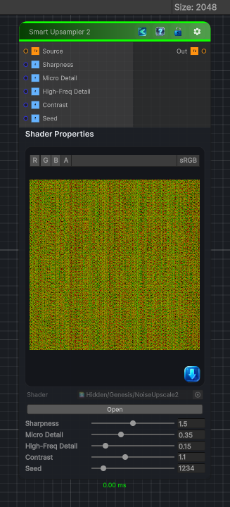

<link rel="stylesheet" href="../_assets/theme.css">

<button type="button" class="genesis-theme-toggle" data-genesis-theme-toggle aria-label="Toggle theme">Dark</button>

---
category: "Transform"
---

# Smart Upsampler 2

> Smart Upsampler 2 is the natural evolution of Noise Upscale 1 — sharper, more contrast‑preserving, and more structure‑aware.

## Description

Smart Upsampler 2 is the natural evolution of Noise Upscale 1 — sharper, more contrast‑preserving, and more structure‑aware. 

## Inputs

| Name | Type | Description |
|------|------|-------------|
| Source | Texture2D |  |
| Sharpness | Single |  |
| Micro Detail | Single |  |
| High-Freq Detail | Single |  |
| Contrast | Single |  |
| Seed | Single |  |

## Outputs

| Name | Type |
|------|------|
| Out | Texture2D |

## Parameters

| Setting | Type | Default | Description |
|---------|------|---------|-------------|
| Sharpness | Range | 1.5 | Controls the sharpness. |
| Micro Detail | Range | 0.35 | Controls the micro detail. |
| High-Freq Detail | Range | 0.15 | Controls the high-freq detail. |
| Contrast | Range | 1.1 | Controls the contrast. |
| Seed | Range | 1234 | Controls the seed. |

## See Also

- [Back to Smart Upsampler 2](./transform-index.md)
