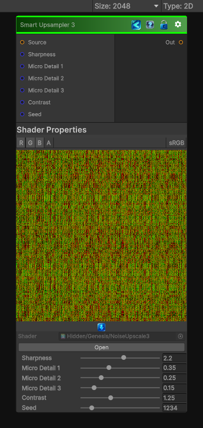

<link rel="stylesheet" href="../_assets/theme.css">

<button type="button" class="genesis-theme-toggle" data-genesis-theme-toggle aria-label="Toggle theme">Dark</button>

---
category: "Transform"
---

# Smart Upsampler 3

> Smart Upsampler 3 is the big-boy variant

## Description

Smart Upsampler 3 is the big-boy variant
✔ Ultra‑sharp reconstruction
✔ High‑frequency detail preservation
✔ Multi‑octave micro‑structure
✔ Stronger contrast shaping
✔ A more “procedural” upscale rather than photographic

## Inputs

| Name | Type | Description |
|------|------|-------------|
| Source | Texture2D |  |
| Sharpness | Single |  |
| Micro Detail 1 | Single |  |
| Micro Detail 2 | Single |  |
| Micro Detail 3 | Single |  |
| Contrast | Single |  |
| Seed | Single |  |

## Outputs

| Name | Type |
|------|------|
| Out | Texture2D |

## Parameters

| Setting | Type | Default | Description |
|---------|------|---------|-------------|
| Sharpness | Range | 2.2 | Controls the sharpness. |
| Micro Detail 1 | Range | 0.35 | Controls the micro detail 1. |
| Micro Detail 2 | Range | 0.25 | Controls the micro detail 2. |
| Micro Detail 3 | Range | 0.15 | Controls the micro detail 3. |
| Contrast | Range | 1.25 | Controls the contrast. |
| Seed | Range | 1234 | Controls the seed. |

## See Also

- [Back to Smart Upsampler 3](./transform-index.md)
