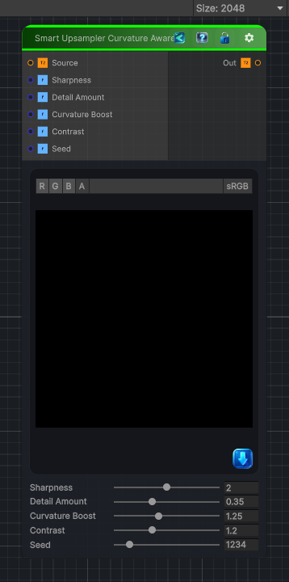

<link rel="stylesheet" href="../_assets/theme.css">

<button type="button" class="genesis-theme-toggle" data-genesis-theme-toggle aria-label="Toggle theme">Dark</button>

---
category: "Transform"
---

# Smart Upsampler Curvature Aware

> Curvature‑Aware Noise Upscale 3 is the smartest member of the upscale family — it doesn’t just preserve edges, it understands surface curvature and adapts the reconstruction accordingly.

## Description

Curvature‑Aware Noise Upscale 3 is the smartest member of the upscale family — it doesn’t just preserve edges, it understands surface curvature and adapts the reconstruction accordingly.
Curvature‑aware upscaling gives you:
✔ Edge preservation
✔ Curvature‑driven sharpening
✔ Detail suppression in concave areas
✔ Detail enhancement on convex ridges
✔ Zero ringing, fully CRT‑safe

## Inputs

| Name | Type | Description |
|------|------|-------------|
| Source | Texture2D |  |
| Sharpness | Single |  |
| Detail Amount | Single |  |
| Curvature Boost | Single |  |
| Contrast | Single |  |
| Seed | Single |  |

## Outputs

| Name | Type |
|------|------|
| Out | Texture2D |

## Parameters

| Setting | Type | Default | Description |
|---------|------|---------|-------------|
| Sharpness | Range | 2.0 | Controls the sharpness. |
| Detail Amount | Range | 0.35 | Controls the detail amount. |
| Curvature Boost | Range | 1.25 | Controls the curvature boost. |
| Contrast | Range | 1.2 | Controls the contrast. |
| Seed | Range | 1234 | Controls the seed. |

## See Also

- [Back to Smart Upsampler Curvature Aware](./transform-index.md)
