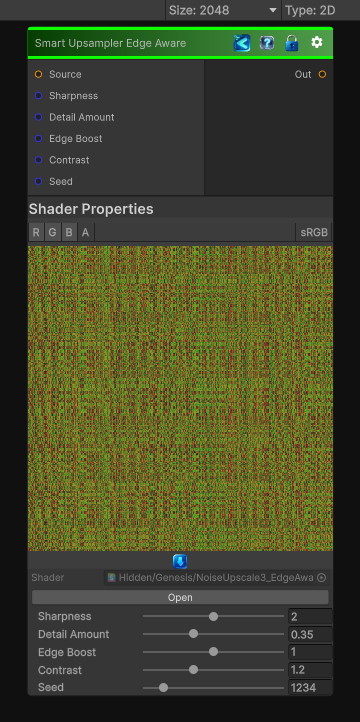

<link rel="stylesheet" href="../_assets/theme.css">

<button type="button" class="genesis-theme-toggle" data-genesis-theme-toggle aria-label="Toggle theme">Dark</button>

---
category: "Transform"
---

# Smart Upsampler Edge Aware

> ✔ Preserves edges

## Description

✔ Preserves edges
✔ Avoids blurring silhouettes
✔ Sharpens structure instead of smearing it
✔ Adds high‑frequency detail only where appropriate
✔ Uses local gradient magnitude to guide reconstruction
This is the perfect companion to your Upscale 1/2/3 family — and it’s exactly the kind of node that makes procedural noise feel hand‑crafted.

## Inputs

| Name | Type | Description |
|------|------|-------------|

## Outputs

| Name | Type |
|------|------|

## Parameters

| Setting | Type | Default | Description |
|---------|------|---------|-------------|
| Sharpness | Range | 2.0 | Controls the sharpness. |
| Detail Amount | Range | 0.35 | Controls the detail amount. |
| Edge Boost | Range | 1.0 | Controls the edge boost. |
| Contrast | Range | 1.2 | Controls the contrast. |
| Seed | Range | 1234 | Controls the seed. |

## See Also

- [Back to Smart Upsampler Edge Aware](./transform-index.md)
