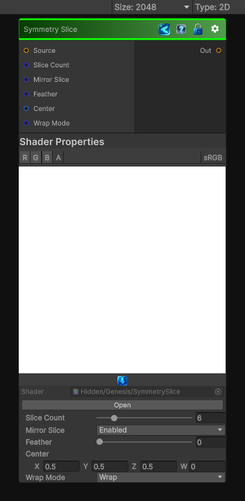

<link rel="stylesheet" href="../_assets/theme.css">

<button type="button" class="genesis-theme-toggle" data-genesis-theme-toggle aria-label="Toggle theme">Dark</button>

---
category: "Transform"
---

# Symmetry Slice

> Symmetry Slice is the designer’s scalpel — the node that lets you carve the texture into angular wedges, mirror them, rotate them, and recombine them into kaleidoscope‑like structures. It’s the backbone of Genesis’s:

## Description

 Symmetry Slice is the designer’s scalpel — the node that lets you carve the texture into angular wedges, mirror them, rotate them, and recombine them into kaleidoscope‑like structures. It’s the backbone of Genesis’s:
- Kaleidoscope
- Radial patterning
- Mandala‑style shapes
- Procedural flowers, gears, spokes
- Symmetry‑driven masks
A proper Symmetry Slice node needs:
✔ Slice count (number of wedges)
✔ Slice angle
✔ Hard or soft slice boundaries
✔ Optional mirroring inside each slice
✔ Pivot control
✔ Wrap/clamp
✔ Deterministic, CRT‑safe

## Inputs

| Name | Type | Description |
|------|------|-------------|

## Outputs

| Name | Type |
|------|------|

## Parameters

| Setting | Type | Default | Description |
|---------|------|---------|-------------|
| Slice Count | Range | 6 | Controls the slice count. |
| Mirror Slice | Enum | 1 | Controls the mirror slice. |
| Feather | Range | 0.0 | Controls the feather. |
| Center | Vector | (0.5, 0.5, 0.5, 0) | Controls the center. |
| Wrap Mode | Enum | 0 // 0 = wrap, 1 = clamp | Controls the wrap mode. |

## See Also

- [Back to Symmetry Slice](./transform-index.md)
