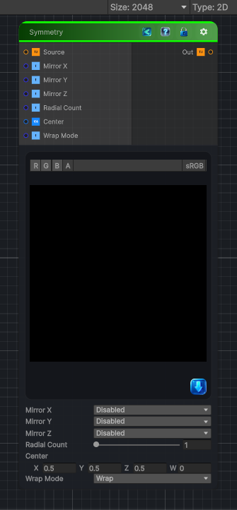

<link rel="stylesheet" href="../_assets/theme.css">

<button type="button" class="genesis-theme-toggle" data-genesis-theme-toggle aria-label="Toggle theme">Dark</button>

---
category: "Transform"
---

# Symmetry

> Symmetry is one of those foundational procedural tools — the kind of node that quietly powers half of Genesis’s shape, pattern, and kaleidoscope workflows. A proper symmetry node should let you:

## Description

 Symmetry is one of those foundational procedural tools — the kind of node that quietly powers half of Genesis’s shape, pattern, and kaleidoscope workflows. A proper symmetry node should let you:
✔ Mirror across X, Y, or both
✔ Choose symmetry count (2‑way, 4‑way, 6‑way, etc.)
✔ Choose pivot/center
✔ Wrap or clamp
✔ Deterministic, CRT‑safe
✔ Works for 2D / 3D / Cube textures

## Inputs

| Name | Type | Description |
|------|------|-------------|
| Source | Texture2D |  |
| Mirror X | Single |  |
| Mirror Y | Single |  |
| Mirror Z | Single |  |
| Radial Count | Single |  |
| Center | Vector4 |  |
| Wrap Mode | Single |  |

## Outputs

| Name | Type |
|------|------|
| Out | Texture2D |

## Parameters

| Setting | Type | Default | Description |
|---------|------|---------|-------------|
| Mirror X | Enum | 0 | Controls the mirror x. |
| Mirror Y | Enum | 0 | Controls the mirror y. |
| Mirror Z | Enum | 0 | Controls the mirror z. |
| Radial Count | Range | 1 | Controls the radial count. |
| Center | Vector | (0.5, 0.5, 0.5, 0) | Controls the center. |
| Wrap Mode | Enum | 0 // 0 = wrap, 1 = clamp | Controls the wrap mode. |

## See Also

- [Back to Symmetry](./transform-index.md)
