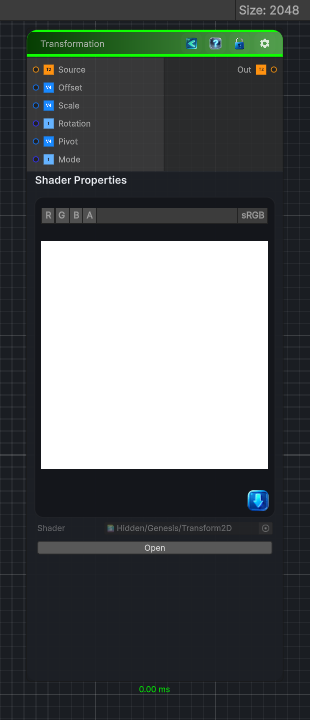

<link rel="stylesheet" href="../_assets/theme.css">

<button type="button" class="genesis-theme-toggle" data-genesis-theme-toggle aria-label="Toggle theme">Dark</button>

---
category: "Transform"
---

# Transformation 2D

> Translation

## Description

Translation

Rotation

Uniform / non‑uniform scale

Pivot control

Optional tiling or clamping

CRT‑safe 2D/3D/Cube behavior

Deterministic, sampler‑free UV math

## Inputs

| Name | Type | Description |
|------|------|-------------|
| Source | Texture2D | Input texture |
| Offset | Vector4 | Translation in UV space |
| Scale | Vector4 | Scale (X,Y) |
| Rotation | Single | Rotation in degrees |
| Pivot | Vector4 | Pivot point (0 to 1) |
| Mode | Single | 0 Wrap, 1 Clamp |

## Outputs

| Name | Type |
|------|------|
| Out | Texture2D |

## Parameters

| Setting | Type | Default | Description |
|---------|------|---------|-------------|
| Source | 2D | white | Input texture |
| Offset | Vector | (0,0,0,0) | Translation in UV space |
| Scale | Vector | (1,1,0,0) | Scale (X,Y) |
| Rotation | Float | 0 | Rotation in degrees |
| Pivot | Vector | (0.5,0.5,0,0) | Pivot point (0 to 1) |
| Mode | Enum | 0 | 0 Wrap, 1 Clamp |

## See Also

- [Back to Transformation 2D](./transform-index.md)
