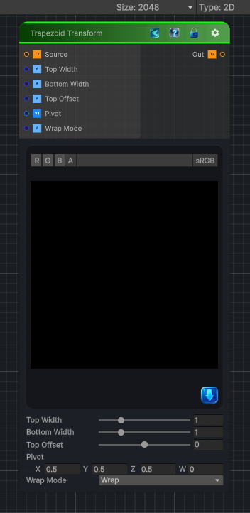

<link rel="stylesheet" href="../_assets/theme.css">

<button type="button" class="genesis-theme-toggle" data-genesis-theme-toggle aria-label="Toggle theme">Dark</button>

---
category: "Transform"
---

# Trapezoid Transform

> Trapezoid Transform is the missing sibling of Quad Transform — a controlled, parameter‑driven way to skew a rectangle into a trapezoid without manually setting four corner points. It’s perfect for:

## Description

Trapezoid Transform is the missing sibling of Quad Transform — a controlled, parameter‑driven way to skew a rectangle into a trapezoid without manually setting four corner points. It’s perfect for:
- Faux‑perspective
- UI slanting
- Book/page‑like distortions
- Stylized projection
- Pre‑warping before polar or kaleidoscope nodes
- Turning rectangles into tapered shapes
A proper Trapezoid Transform node should give you:
✔ Independent top and bottom width
✔ Optional vertical taper
✔ Pivot control
✔ Wrap/clamp
✔ Deterministic, CRT‑safe
✔ Works for 2D / 3D / Cube textures

## Inputs

| Name | Type | Description |
|------|------|-------------|
| Source | Texture2D |  |
| Top Width | Single |  |
| Bottom Width | Single |  |
| Top Offset | Single |  |
| Pivot | Vector4 |  |
| Wrap Mode | Single |  |

## Outputs

| Name | Type |
|------|------|
| Out | Texture2D |

## Parameters

| Setting | Type | Default | Description |
|---------|------|---------|-------------|
| Top Width | Range | 1.0 | Controls the top width. |
| Bottom Width | Range | 1.0 | Controls the bottom width. |
| Top Offset | Range | 0.0 | Controls the top offset. |
| Pivot | Vector | (0.5, 0.5, 0.5, 0) | Controls the pivot. |
| Wrap Mode | Enum | 0 // 0 = wrap, 1 = clamp | Controls the wrap mode. |

## See Also

- [Back to Trapezoid Transform](./transform-index.md)
