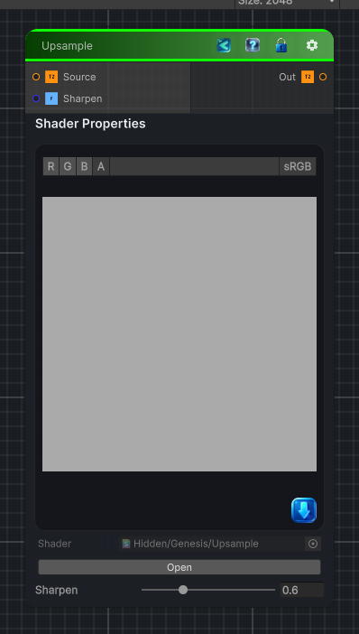

<link rel="stylesheet" href="../_assets/theme.css">

<button type="button" class="genesis-theme-toggle" data-genesis-theme-toggle aria-label="Toggle theme">Dark</button>

---
category: "Transform"
---

# Upsample

> Upsamples an input texture

## Description

 Upsamples an input texture

## Inputs

| Name | Type | Description |
|------|------|-------------|
| Source | Texture2D | Low resolution source input |
| Sharpen | Single | Sharpen strength |

## Outputs

| Name | Type |
|------|------|
| Out | Texture2D |

## Parameters

| Setting | Type | Default | Description |
|---------|------|---------|-------------|
| Source | 2D | white | Low resolution source input |
| Sharpen | Range | 0.6 | Sharpen strength |

## See Also

- [Back to Upsample](./transform-index.md)
