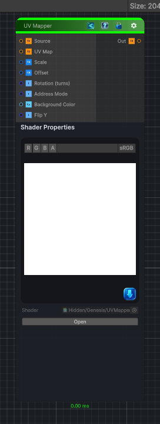

<link rel="stylesheet" href="../_assets/theme.css">

<button type="button" class="genesis-theme-toggle" data-genesis-theme-toggle aria-label="Toggle theme">Dark</button>

---
category: "Transform"
---

# UV Mapper

> Remaps a source image through an input UV map, similar to Substance Designer's UV Mapper node.

## Description

Remaps a source image through an input UV map, similar to Substance Designer's UV Mapper node.

## Inputs

| Name | Type | Description |
|------|------|-------------|
| Source | Texture2D |  |
| UV Map | Texture2D |  |
| Scale | Vector4 |  |
| Offset | Vector4 |  |
| Rotation (turns) | Single |  |
| Address Mode | Single |  |
| Background Color | Color |  |
| Flip Y | Single |  |

## Outputs

| Name | Type |
|------|------|
| Out | Texture2D |

## Parameters

| Setting | Type | Default | Description |
|---------|------|---------|-------------|
| Scale | Vector | (1.0, 1.0, 0.0, 0.0) | Controls the scale. |
| Offset | Vector | (0.0, 0.0, 0.0, 0.0) | Controls the offset. |
| Rotation (turns) | Range | 0.0 | Controls the rotation (turns). |
| Address Mode | Enum | 0 | Controls the address mode. |
| Background Color | Color | (0.0, 0.0, 0.0, 1.0) | Controls the background color. |
| Flip Y | Toggle | 0 | Controls the flip y. |

## See Also

- [Back to UV Mapper](./transform-index.md)
