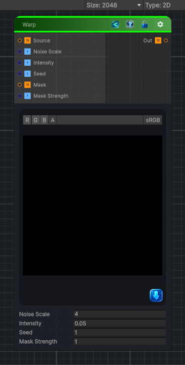

<link rel="stylesheet" href="../_assets/theme.css">

<button type="button" class="genesis-theme-toggle" data-genesis-theme-toggle aria-label="Toggle theme">Dark</button>

---
category: "Transform"
---

# Warp

> This is the Genesis Noise node that produces:

## Description

This is the Genesis Noise node that produces:
Organic smearing
Blobby distortions
Melting effects
Soft turbulence
Height‑based warping

And it’s distinct from Directional Warp or Vector Warp.

## Inputs

| Name | Type | Description |
|------|------|-------------|
| Source | Texture2D | Input texture |
| Noise Scale | Single | Noise scale |
| Intensity | Single | Warp intensity |
| Seed | Single | Random seed |
| Mask | Texture2D | Optional mask |
| Mask Strength | Single | Mask strength |

## Outputs

| Name | Type |
|------|------|
| Out | Texture2D |

## Parameters

| Setting | Type | Default | Description |
|---------|------|---------|-------------|
| nodeVariables | VariableStorage | AhahGames.GenesisNoise.Graph.VariableStorage | |
| GUID | String | 592933a6-9c38-40ff-a14d-6533829ee968 | |
| expanded | Boolean | False | |

## See Also

- [Back to Warp](./transform-index.md)
