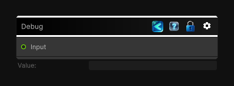

<link rel="stylesheet" href="../_assets/theme.css">

<button type="button" class="genesis-theme-toggle" data-genesis-theme-toggle aria-label="Toggle theme">Dark</button>

---
category: "Utility"
---

# Debug

> Inspects values during graph authoring and debugging.

## Description

Inspects values during graph authoring and debugging.

## Inputs

| Name | Type | Description |
|------|------|-------------|

## Outputs

| Name | Type |
|------|------|

## Parameters

| Setting | Type | Default | Description |
|---------|------|---------|-------------|
| value | String | — | |
| nodeVariables | VariableStorage | AhahGames.GenesisNoise.Graph.VariableStorage | |
| GUID | String | 700ccec4-e1df-4e13-b4bc-73813ed008eb | |
| expanded | Boolean | False | |

## See Also

- [Back to Debug](./utility-index.md)
