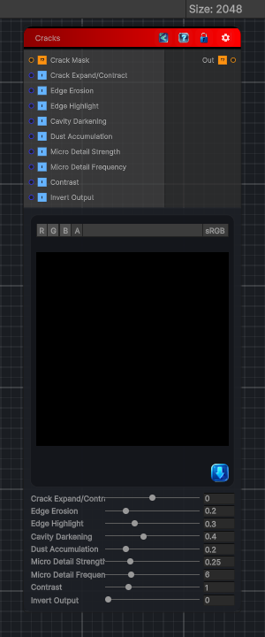

<link rel="stylesheet" href="../_assets/theme.css">

<button type="button" class="genesis-theme-toggle" data-genesis-theme-toggle aria-label="Toggle theme">Dark</button>

---
category: "Wear"
---

# Cracks

> - Extract crack lines from an input (usually height or mask)

## Description

- Extract crack lines from an input (usually height or mask)
- Expand or contract the cracks
- Add micro‑erosion around crack edges
- Add cavity darkening
- Add edge brightening
- Add optional dust accumulation
- Output a clean mask or stylized crack map

## Inputs

| Name | Type | Description |
|------|------|-------------|
| Crack Mask | Texture2D |  |
| Crack Expand/Contract | Single |  |
| Edge Erosion | Single |  |
| Edge Highlight | Single |  |
| Cavity Darkening | Single |  |
| Dust Accumulation | Single |  |
| Micro Detail Strength | Single |  |
| Micro Detail Frequency | Single |  |
| Contrast | Single |  |
| Invert Output | Single |  |

## Outputs

| Name | Type |
|------|------|
| Out | Texture2D |

## Parameters

| Setting | Type | Default | Description |
|---------|------|---------|-------------|
| Crack Expand/Contract | Range | 0.0 | Controls the crack expand/contract. |
| Edge Erosion | Range | 0.2 | Controls the edge erosion. |
| Edge Highlight | Range | 0.3 | Controls the edge highlight. |
| Cavity Darkening | Range | 0.4 | Controls the cavity darkening. |
| Dust Accumulation | Range | 0.2 | Controls the dust accumulation. |
| Micro Detail Strength | Range | 0.25 | Controls the micro detail strength. |
| Micro Detail Frequency | Range | 6.0 | Controls the micro detail frequency. |
| Contrast | Range | 1.0 | Controls the contrast. |
| Invert Output | Range | 0 | Controls the invert output. |

## See Also

- [Back to Cracks](./wear-index.md)
