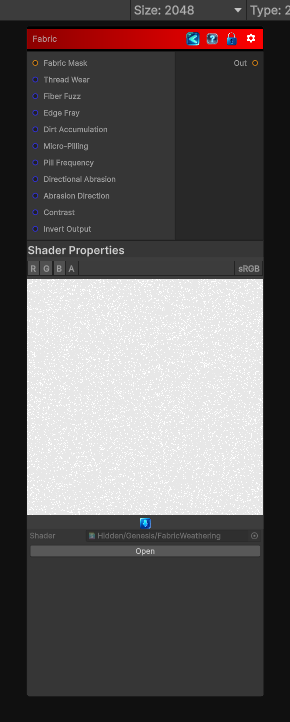

<link rel="stylesheet" href="../_assets/theme.css">

<button type="button" class="genesis-theme-toggle" data-genesis-theme-toggle aria-label="Toggle theme">Dark</button>

---
category: "Wear"
---

# Fabric

> Dedicated fabric‑specific wear model that simulates:

## Description

Dedicated fabric‑specific wear model that simulates:
- Fiber fuzzing
- Thread thinning
- Edge fray
- Dirt accumulation
- Wear along weave direction
- Micro‑pilling
- High‑frequency fiber breakup
- Directional abrasion

## Inputs

| Name | Type | Description |
|------|------|-------------|

## Outputs

| Name | Type |
|------|------|

## Parameters

| Setting | Type | Default | Description |
|---------|------|---------|-------------|
| Thread Wear | Range | 0.4 | Controls the thread wear. |
| Fiber Fuzz | Range | 0.35 | Controls the fiber fuzz. |
| Edge Fray | Range | 0.3 | Controls the edge fray. |
| Dirt Accumulation | Range | 0.25 | Controls the dirt accumulation. |
| Micro-Pilling | Range | 0.3 | Controls the micro-pilling. |
| Pill Frequency | Range | 8.0 | Controls the pill frequency. |
| Directional Abrasion | Range | 0.4 | Controls the directional abrasion. |
| Abrasion Direction | Range | 0.0 | Controls the abrasion direction. |
| Contrast | Range | 1.0 | Controls the contrast. |
| Invert Output | Range | 0 | Controls the invert output. |

## See Also

- [Back to Fabric](./wear-index.md)
