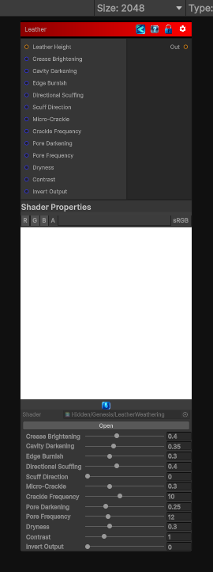

<link rel="stylesheet" href="../_assets/theme.css">

<button type="button" class="genesis-theme-toggle" data-genesis-theme-toggle aria-label="Toggle theme">Dark</button>

---
category: "Wear"
---

# Leather

> Leather has a very distinct wear signature compared to fabric or stone:

## Description

Leather has a very distinct wear signature compared to fabric or stone:
• 	Crease brightening
• 	Oil darkening in cavities
• 	Scuffing along direction of motion
• 	Crackle micro‑cracks
• 	Edge burnishing
• 	Pore darkening
• 	Dryness (desaturation + roughness increase)
• 	Micro‑grain breakup
We can simulate all of this in a single‑pass, deterministic Genesis CRT node using:
• 	Analytic curvature
• 	Directional abrasion
• 	Micro‑crackle noise
• 	Pore darkening
• 	Edge burnish
• 	Dryness shaping

## Inputs

| Name | Type | Description |
|------|------|-------------|

## Outputs

| Name | Type |
|------|------|

## Parameters

| Setting | Type | Default | Description |
|---------|------|---------|-------------|
| Crease Brightening | Range | 0.4 | Controls the crease brightening. |
| Cavity Darkening | Range | 0.35 | Controls the cavity darkening. |
| Edge Burnish | Range | 0.3 | Controls the edge burnish. |
| Directional Scuffing | Range | 0.4 | Controls the directional scuffing. |
| Scuff Direction | Range | 0.0 | Controls the scuff direction. |
| Micro-Crackle | Range | 0.3 | Controls the micro-crackle. |
| Crackle Frequency | Range | 10.0 | Controls the crackle frequency. |
| Pore Darkening | Range | 0.25 | Controls the pore darkening. |
| Pore Frequency | Range | 12.0 | Controls the pore frequency. |
| Dryness | Range | 0.3 | Controls the dryness. |
| Contrast | Range | 1.0 | Controls the contrast. |
| Invert Output | Range | 0 | Controls the invert output. |

## See Also

- [Back to Leather](./wear-index.md)
