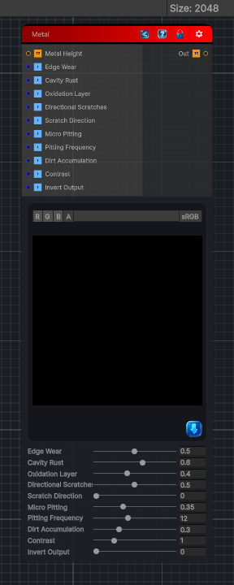

<link rel="stylesheet" href="../_assets/theme.css">

<button type="button" class="genesis-theme-toggle" data-genesis-theme-toggle aria-label="Toggle theme">Dark</button>

---
category: "Wear"
---

# Metal

> Metal ages in ways that are completely different from fabric, leather, or stone. It develops:

## Description

Metal ages in ways that are completely different from fabric, leather, or stone. It develops:
- Edge wear / brightening
- Cavity rust
- Oxidation layers
- Pitting and micro‑corrosion
- Directional scratches
- Oil/dirt accumulation
- Heat tinting (optional)
Genesis achieves this through curvature, cavity detection, micro‑noise, and directional abrasion.

## Inputs

| Name | Type | Description |
|------|------|-------------|
| Metal Height | Texture2D |  |
| Edge Wear | Single |  |
| Cavity Rust | Single |  |
| Oxidation Layer | Single |  |
| Directional Scratches | Single |  |
| Scratch Direction | Single |  |
| Micro Pitting | Single |  |
| Pitting Frequency | Single |  |
| Dirt Accumulation | Single |  |
| Contrast | Single |  |
| Invert Output | Single |  |

## Outputs

| Name | Type |
|------|------|
| Out | Texture2D |

## Parameters

| Setting | Type | Default | Description |
|---------|------|---------|-------------|
| Edge Wear | Range | 0.5 | Controls the edge wear. |
| Cavity Rust | Range | 0.6 | Controls the cavity rust. |
| Oxidation Layer | Range | 0.4 | Controls the oxidation layer. |
| Directional Scratches | Range | 0.5 | Controls the directional scratches. |
| Scratch Direction | Range | 0.0 | Controls the scratch direction. |
| Micro Pitting | Range | 0.35 | Controls the micro pitting. |
| Pitting Frequency | Range | 12.0 | Controls the pitting frequency. |
| Dirt Accumulation | Range | 0.3 | Controls the dirt accumulation. |
| Contrast | Range | 1.0 | Controls the contrast. |
| Invert Output | Range | 0 | Controls the invert output. |

## See Also

- [Back to Metal](./wear-index.md)
