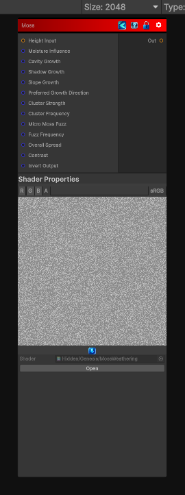

<link rel="stylesheet" href="../_assets/theme.css">

<button type="button" class="genesis-theme-toggle" data-genesis-theme-toggle aria-label="Toggle theme">Dark</button>

---
category: "Wear"
---

# Moss

> - Moisture retention

## Description

- Moisture retention
- Shadowed / occluded areas
- Surface roughness
- Crevices and cavities
- North‑facing slopes
- Ambient humidity
- Random organic clustering

## Inputs

| Name | Type | Description |
|------|------|-------------|

## Outputs

| Name | Type |
|------|------|

## Parameters

| Setting | Type | Default | Description |
|---------|------|---------|-------------|
| Moisture Influence | Range | 0.5 | Controls the moisture influence. |
| Cavity Growth | Range | 0.6 | Controls the cavity growth. |
| Shadow Growth | Range | 0.5 | Controls the shadow growth. |
| Slope Growth | Range | 0.4 | Controls the slope growth. |
| Preferred Growth Direction | Range | 0.0 | Controls the preferred growth direction. |
| Cluster Strength | Range | 0.5 | Controls the cluster strength. |
| Cluster Frequency | Range | 6.0 | Controls the cluster frequency. |
| Micro Moss Fuzz | Range | 0.25 | Controls the micro moss fuzz. |
| Fuzz Frequency | Range | 12.0 | Controls the fuzz frequency. |
| Overall Spread | Range | 0.5 | Controls the overall spread. |
| Contrast | Range | 1.0 | Controls the contrast. |
| Invert Output | Range | 0 | Controls the invert output. |

## See Also

- [Back to Moss](./wear-index.md)
