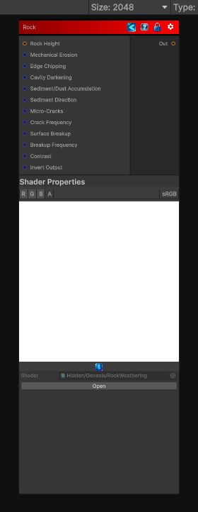

<link rel="stylesheet" href="../_assets/theme.css">

<button type="button" class="genesis-theme-toggle" data-genesis-theme-toggle aria-label="Toggle theme">Dark</button>

---
category: "Wear"
---

# Rock

> Rock Weathering is one of the most visually rewarding material effects you can add.  Rock ages through a combination of:

## Description

Rock Weathering is one of the most visually rewarding material effects you can add.  Rock ages through a combination of:
- Mechanical erosion (wind, water, abrasion)
- Chemical weathering (dissolution, oxidation)
- Cavity darkening
- Edge chipping
- Sediment/dust accumulation
- Micro‑cracks
- Lichen/moss precursors
- Directional wear

## Inputs

| Name | Type | Description |
|------|------|-------------|

## Outputs

| Name | Type |
|------|------|

## Parameters

| Setting | Type | Default | Description |
|---------|------|---------|-------------|
| Mechanical Erosion | Range | 0.45 | Controls the mechanical erosion. |
| Edge Chipping | Range | 0.35 | Controls the edge chipping. |
| Cavity Darkening | Range | 0.5 | Controls the cavity darkening. |
| Sediment/Dust Accumulation | Range | 0.4 | Controls the sediment/dust accumulation. |
| Sediment Direction | Range | 0.0 | Controls the sediment direction. |
| Micro-Cracks | Range | 0.35 | Controls the micro-cracks. |
| Crack Frequency | Range | 10.0 | Controls the crack frequency. |
| Surface Breakup | Range | 0.3 | Controls the surface breakup. |
| Breakup Frequency | Range | 8.0 | Controls the breakup frequency. |
| Contrast | Range | 1.0 | Controls the contrast. |
| Invert Output | Range | 0 | Controls the invert output. |

## See Also

- [Back to Rock](./wear-index.md)
