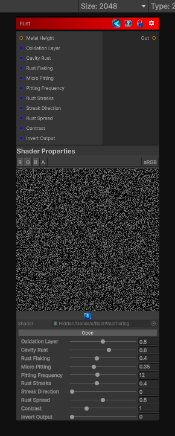

<link rel="stylesheet" href="../_assets/theme.css">

<button type="button" class="genesis-theme-toggle" data-genesis-theme-toggle aria-label="Toggle theme">Dark</button>

---
category: "Wear"
---

# Rust

> Rust Weathering is one of the most iconic, high‑impact material effects in procedural texturing — and it’s a perfect addition to your growing Material Weathering suite. Rust is not just “orange noise”; it forms through a combination of:

## Description

Rust Weathering is one of the most iconic, high‑impact material effects in procedural texturing — and it’s a perfect addition to your growing Material Weathering suite. Rust is not just “orange noise”; it forms through a combination of:
- Cavity moisture retention
- Surface oxidation
- Pitting corrosion
- Flaking and chipping
- Directional runoff
- Iron oxide bloom
- Micro‑scale roughness increase

## Inputs

| Name | Type | Description |
|------|------|-------------|

## Outputs

| Name | Type |
|------|------|

## Parameters

| Setting | Type | Default | Description |
|---------|------|---------|-------------|
| Oxidation Layer | Range | 0.5 | Controls the oxidation layer. |
| Cavity Rust | Range | 0.6 | Controls the cavity rust. |
| Rust Flaking | Range | 0.4 | Controls the rust flaking. |
| Micro Pitting | Range | 0.35 | Controls the micro pitting. |
| Pitting Frequency | Range | 12.0 | Controls the pitting frequency. |
| Rust Streaks | Range | 0.4 | Controls the rust streaks. |
| Streak Direction | Range | 0.0 | Controls the streak direction. |
| Rust Spread | Range | 0.5 | Controls the rust spread. |
| Contrast | Range | 1.0 | Controls the contrast. |
| Invert Output | Range | 0 | Controls the invert output. |

## See Also

- [Back to Rust](./wear-index.md)
